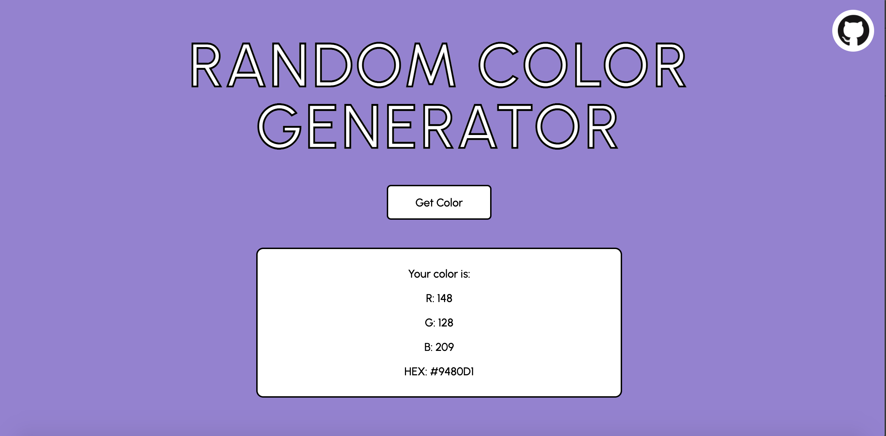

# Color-Generator
A simple JavaScript web page that generates a random background color when the user presses a button. RGB and HEX values for the color are displayed so that the user can replicate the color in any program. This was my first JavaScript project and was created as a fun way to learn how to use JavaScript.

To view the project, <a href="https://ivanamiovcic.github.io/Color-Generator/"> click here</a>. 
 
 

## Technologies
This site was made with: 
- JavaScript
- HTML 5
- CSS 3
